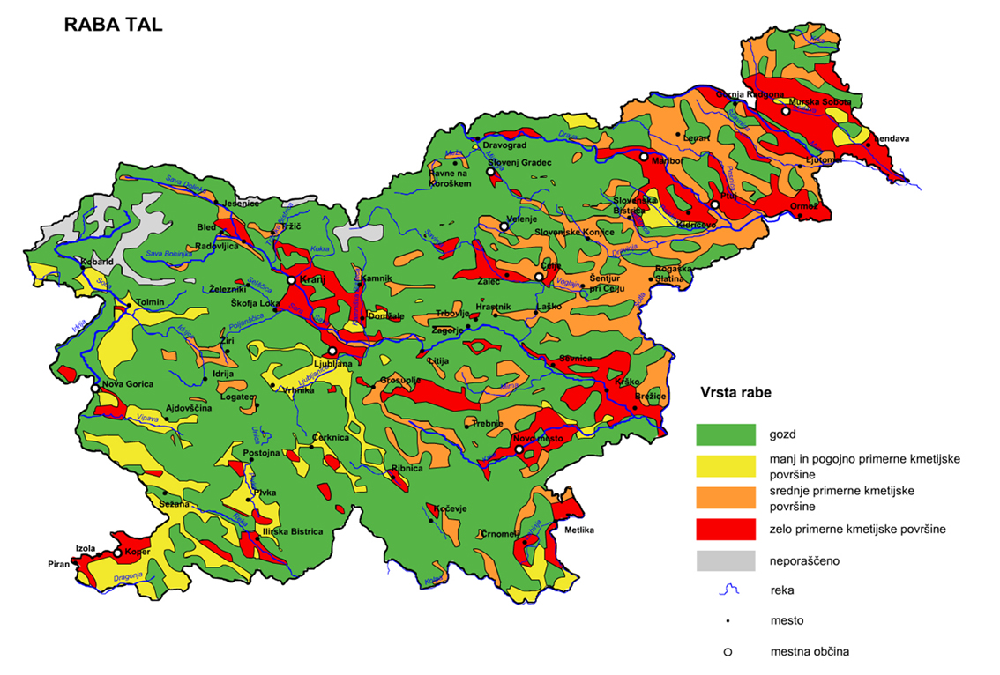

# KMETIJSTVO 
# Predstavitev gospodarske dejavnosti z osnovnimi pojmi in izhodišči

## Osnovne značilnosti
- **Kmetijstvo ali agrikultura je človekova dejavnost, ki se ukvarja z gojenjem rastlin in živali za hrano in surovine, običajno udomačenih živali in kulturnih rastlin**
- v Sloveniji kmetijska zemljišča predstavljajo **32% celotnega ozemlja**
- ustvarja zelo **majhen del - 2% - bruto domačega proizvoda** (**BDP**)
- kmetijstvo - **primarni sektor**
- osnovne kmetijske **panoge**:
    - **poljedelstvo**
    - **živinoreja**
    - **sadjarstvo**
    - **vinogradništvo**
- **vrste** kmetijstva:
    - **intenzivno** kmetijstvo
    - **ekokmetijstvo**/**biokmetijstvo**
    - int
- **zemljiške kategorije** - kaj na zemljišču raste?:
    - **njiva**
    - vrt
    - **vinograd**
    - **sadovnjak**
    - **travnik**
    - **pašnik**
    - gozd
- zemljišča v **največji uporabi**:
    - **travniki**
    - **pašniki**
- **manj v uporabi**:
    - **vinogradi**
    - **sadovnjaki**
    - **njive**
- zagotavlja **oskrbo prebivalstva** z osnovnimi živili
<!-- - ohranja **poselitev podeželja**, preprečuje razpad **kulturne krajine** -->
- pri nekaterih pridelkih **ne pokrijemo svojih potreb** - **proizvod niha in celo upada**
    - kupujemo vse več **uvožene hrane**
- po **osamosvojitvi** je **​upadlo št kmetijskih gospodarstev** in delež **kmetijskih zemljišč**
- **nacinalizacija veleposesti** po ww2 (**socializem**) - državna posestva - **kmetijski kombinati**, ti so sestavlaji **družbeni sektor kmetijstva** - večinoma **najboljša zemljišča**, največ **družbene podpore**
- **družbeni sektor najbolj produktiven**
- **zasebni sektor** - zasebne kmetije, večina kmetih 
- po **osamosvijitvi** je večina nekdanjih **nacionaliziranih zemljišč vrnjenih nekdanjim lastnikom** (zasebna last)
- nekdanji **družbeni sektor** - **kmetijska podjetja in zadruge**
- ^ višja produktivnost kot pri **družinskih kmetijah** - zavzemajo večino kmetijskih zemljišč

## Neugodne naravne razmere
- **naravni pogoji**, ki vplivajo na kmetijstvo:
    - **relief**
    - **podnebje**
    - **voda**
    - **prst**
- **manj ugodne** kmetijske razmere
    - **hribovit/kraški relief** - prevelike strmine
    - **razčlenjeno površje**
    - **manj ugodna podnebja**
    - **pomanjkanje rodovitne prsti**
- ~3/4 kmetijskih zemljišč leži na **manj primernih območjih**
- najbolj **primerna zemljišča** večinoma **Obpanonska pokrajina**
- 
- **melioracija** - posegi za **izboljšavo možnosti za pridelovanje**
    - **hidromelioracija** - **namakanje** ali **osuševanje** tal
        - namakalnih sistemov imamo **premalo**
        - **osuševanje zamočvirjenih zemljišč** - Obpanonska nižina - pridobivanje več obdelovalnih površin - zvišana porizvodnja hrane
        - ^ **slabo za okolje/vodne razmere** - padla gladina podtalnice - **uničenje življenskega okolja močvirskih rastlin in živali**
- **poljedelstvo** omejeno na **SV Slovenije**(ob Dravi, Lj. kotlina, Celjska kotlina, Krško polje, Vipavska dolina)
- **največ žitnih polj** v **Obšanonskih** pokrajinah
- na **njivah** večinoma **pšenica, koruza, krompir**
- za pridelavo vrtnin **najbolj primerna Primorska pokrajina**
- **vrtnine** na manjših njivah in vrtovih - **korenje, čebula, paradižnik, kumare, fižol, zelje, različne solate**

## Neugodni družbeni dejavniki
- **zemljiška razdrobljenost** - več **manjših obdelovalnih površin** razpršenih na **več delov**
    - **majhna zemljišča**
        - na to vpliva **dedovanje manjših zemljišč**
        - velikost kmetijskih obratov se je začela **večati šele po osamosvojitvi**
        - št kmetij je **upadlo**
        - **več manjših kmetij** in zelo **malo** kmetijskih gospodarstev **nad 2ha**
    - **prostorska razporeditev parcel**
        - posamezne **parcele razpršene in pomešane** med drugimi lastniki
        - uporaba kmetijske mehanizacije negospodarna
        - problem veliko **manjši v zadrugah**, ker je **več zemljišč sklenjenih skupaj**
- **slaba starostna in izobrazbena sestava delovne sile**
    - Rok

## Spreminjanje rabe tal
- vplivali neugodni **naravni in družbeni** dejavniki
- **ozelenjevanje** - spreminjanje **kmetijskih zemljišč v travnike** zaradi opuščanja kmetijstva
- **ogozdovanje** - zaraščanje kmetijskih zemljišč z **gozdovi**
- ^ procesa **značilna za hribovska in prometno odročna** območja
- gozd **~2/3** Slovenije
- opuščena zemljišča v **kotlinah in nižinah** pozidana
    - **predalpske kotline** ponekod v **Opanonskih pokrajinah**
- **Slo.** spada med države, kjer se kmetijska zemljišča še naprej **nepovratno izgublja** iz leta v leto

## Pomen

### Viri
- internet:
    - https://sl.wikipedia.org/wiki/Kmetijstvo, dostopano 22. 11. 2022
    - https://eucbeniki.sio.si/geo9/2627/, dostopano 23. 11. 2022
- knjige:
    - GEOGRAFIJA SLOVENIJE Učbenik za 9. razred osnovne šole
- slike:
    - https://eucbeniki.sio.si/geo9/2627/Raba_tal.png, dostopano 23. 11. 2022

### Uprašaj!! (Temp) - 24. 11. 2022
- neugodni družbeni dejavniki -> slaba stariostna in izobrazbena sestava + delež BDP -> to pripada Roku?
- spreminjanje rabe tal -> gozd še spada pod kmetijstvo??
- jaz samo opišem pojme ali opisujem kot pirbližno v učb?