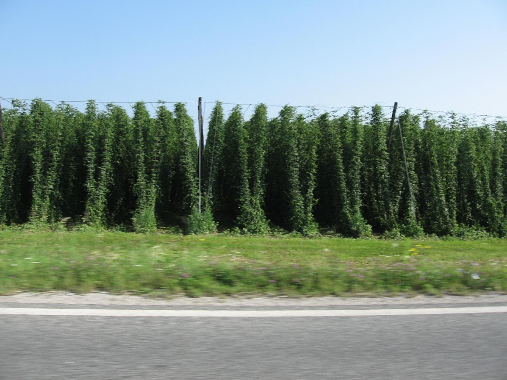
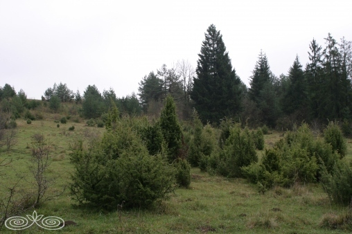

# KMETIJSTVO 
# Predstavitev gospodarske dejavnosti z osnovnimi pojmi in izhodišči

## Osnovne značilnosti
- **kmetijstvo ali agrikultura je človekova dejavnost, ki se ukvarja z gojenjem rastlin in živali za hrano in surovine, običajno udomačenih živali in kulturnih rastlin**
- v Sloveniji kmetijska zemljišča predstavljajo **32% celotnega ozemlja**
- ustvarja zelo **majhen del - 0,8% v letu 2021 - bruto domačega proizvoda** (**BDP**)
- kmetijstvo - **primarni sektor** gospodarstva
- osnovne kmetijske **panoge**:
    - **poljedelstvo**
    - **živinoreja**
    - **sadjarstvo**
    - **vinogradništvo**
- **vrste** kmetijstva:
    - **intenzivno** kmetijstvo - velika **uporaba pesticidov** in **gnojil** za **hitrejšo rast** in **večjo količino** uspelega pridelka
    - **ekokmetijstvo**/**biokmetijstvo** - **okolju prijazen** način kmetovanja, **brez umetnih pesticidov**, **gnojil** in **gensko spremenjenih** semen. Uporaba **organskih gnojil**, **kolobarjenje** in **prosta paša** živine
    - **intergrirana pridelava** - **mešanica inetenzivnega in ekološkega** kmetovanja. **Manjša uporaba pesticidov** kot pri intenzivni, a so **samo nekateri dovoljeni** v omejenih količinah.
    - **specializirano kmetijstvo** - množična pridelava le enega pridelka
- **zemljiške kategorije** - kaj na zemljišču raste?:
    - **njiva**
    - vrt
    - **vinograd**
    - **sadovnjak**
    - **travnik**
    - **pašnik**
    - gozd

- zemljišča v **največji uporabi**:
    - **travniki**
    - **pašniki**
- **manj v uporabi**:
    - **vinogradi**
    - **sadovnjaki**
    - **njive**
- zagotavlja **oskrbo prebivalstva** z osnovnimi živili
<!-- - ohranja **poselitev podeželja**, preprečuje razpad **kulturne krajine** -->
- pri nekaterih pridelkih **ne pokrijemo svojih potreb** - **proizvod niha in celo upada**
    - kupujemo vse več **uvožene hrane**
- po **osamosvojitvi** je **​upadlo št kmetijskih gospodarstev** in delež **kmetijskih zemljišč**
- **nacionalizacija veleposesti** po ww2 (**socializem**), to postanejo državna posestva, ta so se spremenila v **kmetijske kombinate**, ti so sestavlaji **družbeni sektor kmetijstva** 
- večinoma **najboljša zemljišča**, največ **družbene podpore**
- **družbeni sektor najbolj produktiven**
- **zasebni sektor** - zasebne kmetije, večina kmetij 
- po **osamosvijitvi** je večina nekdanjih **nacionaliziranih zemljišč vrnjenih nekdanjim lastnikom** (zasebna last)
- nekdanji **družbeni sektor** - **kmetijska podjetja in zadruge**
- ^ višja produktivnost kot pri **družinskih kmetijah** - zavzemajo večino kmetijskih zemljišč

## Naravni dejavniki
- **naravni pogoji**, ki vplivajo na kmetijstvo:
    - **relief**
    - **podnebje**
    - **voda**
    - **prst**
- **manj ugodne** kmetijske razmere
    - **hribovit/kraški relief** - prevelike strmine
    - **razčlenjeno površje**
    - **manj ugodna podnebja**
    - **pomanjkanje rodovitne prsti**
- ~3/4 kmetijskih zemljišč leži na **manj primernih območjih**
- najbolj **primerna zemljišča** večinoma **Obpanonska pokrajina**

- **melioracija** - posegi za **izboljšavo možnosti za pridelovanje**
    - **hidromelioracija** - **namakanje** ali **osuševanje** tal
        - namakalnih sistemov imamo **premalo**
        - **osuševanje zamočvirjenih zemljišč** - Obpanonska nižina - pridobivanje več obdelovalnih površin - zvišana porizvodnja hrane
        - ^ **slabo za okolje/vodne razmere** - padla gladina podtalnice - **uničenje življenskega okolja močvirskih rastlin in živali**

## Družbeni dejavniki
- **mehnizacija** - uporaba strojev:
    - potreba po **delovni sili** se je **zmanjšala**

- **zemljiška razdrobljenost** - več **manjših obdelovalnih površin** razpršenih na **več delov**
    - **majhna zemljišča**
        - na to vpliva **dedovanje manjših zemljišč**
        - velikost kmetijskih obratov se je začela **večati šele po osamosvojitvi**
        - št kmetij je **upadlo**
        - **več manjših kmetij** in zelo **malo** veklikih kmetijskih gospodarstev
        - **povprečna kmetija** je velika **7ha** - leto 2020, dobičkonosno bi bilo **najmanj 10ha**
        
    - **prostorska razporeditev parcel**
        - posamezne **parcele razpršene in pomešane** med drugimi lastniki
        - uporaba kmetijske mehanizacije negospodarna
        - problem veliko **manjši v zadrugah**, ker je **več zemljišč sklenjenih skupaj**
- **slaba starostna in izobrazbena sestava delovne sile**
    - Rok

## Poljedelstvo in Živinoreja
- **poljedelstvo** - kmetijska panoga, ki se ukvarja s **pridelavo rastlin**
- **poljedelstvo** omejeno na **SV Slovenije**(ob Dravi, Lj. kotlina, Celjska kotlina, Krško polje, Vipavska dolina)
- **največ žitnih polj** v **Obšanonskih** pokrajinah
- na **njivah** večinoma **pšenica, koruza, krompir**
- za pridelavo vrtnin **najbolj primerna Primorska pokrajina**
- **vrtnine** na manjših njivah in vrtovih - **korenje, čebula, paradižnik, kumare, fižol, zelje, različne solate**
- **manjši del njiv** je namenjen **industrijskim rastlinam** - **hmelju, sladkorni pesi, sončnicam, bučam za olje in olji ogrščici**

- **živinoreja** je **kmetijska panoga**, ki se ukvarja z **gojitvijo domačih živali** z namenom pridobivanja **prehranskih proizvodov**, samih živali za **delovno živino**, **surovin** za oblačila in obutev ter **gnoja** 
- **živinoreja** je **najpomembnejša** kmetijska dejavnost v Sloveniji:
    - v **hribovitih** predelih - **pašna živinoreja**
    - po vsej Sloveniji - **intenzivna hlevska živinoreja**
        - rejenja goveda za **pridelavo mleka in mesa**
        - razvoj **govedoreje** vplival na **delež njiv s krmnimi rastlinami**
    - po **celi Sloveniji** je pomembno tudi** perutninarstvo** - gojenje perutnine(udomačene ptice)
    - večinoma **Opanonska pokrajina** - **prašičereja**
    - majhen del tudi **drobnica**(ovce, koze) in konjereja - večinoma **dodatna dejavnost**

## Vinogradništvo in sadjarstvo
- panogi s tradicijo **vezani na obpanonske in obsredozemske pokrajine**
- v **obsredozemskih** pokrajinah uspeva **oljka, češnje, breskve, marelice**
- **jabolka in hruške** po **vsej Sloveniji**
- slovenska **vina** so dobro **znana v tujini**
- Slovenija ima **3 vinorodna območja**:
    - **razlika** v:
        - **prsti**
        - **podnebju**
        - **po izboru vinskih sort**
    - **obomčja**:
        - **Podravsko** vinorodno območje:
            - **karbonatne kaminine in peščenjaki**
            - **laški rizling, šardone, šipon, renski rizling, beli pinot**
        - **Posavsko** vinorodno območje:
            - **lapor, peščenjakiv**
            - **redeče sorte(modra frankinja, cviček)**
        - **Primorsko** vinorodno območje:
            - **apnenec in fliš**
            - **refošk, rebula, merlot, teran, malvazija, kaberne, sovinjon**, ...

## Spreminjanje rabe tal
- vplivali neugodni **naravni in družbeni** dejavniki
- **ozelenjevanje** - spreminjanje **kmetijskih zemljišč v travnike** zaradi opuščanja kmetijstva
- **ogozdovanje** - zaraščanje kmetijskih zemljišč z **gozdovi**

- ^ procesa **značilna za hribovska in prometno odročna** območja
- gozd **~2/3** Slovenije
- opuščena zemljišča v **kotlinah in nižinah** pozidana
    - **predalpske kotline** ponekod v **Opanonskih pokrajinah**
- **Slovenija** spada med države, kjer se kmetijska zemljišča še naprej **nepovratno izgublja** iz leta v leto

### Viri
- internet:
    - https://sl.wikipedia.org/wiki/Kmetijstvo, dostopano 22. 11. 2022
    - https://eucbeniki.sio.si/geo9/2627/, dostopano 23. 11. 2022
    - https://sl.wikipedia.org/wiki/%C5%BDivinoreja, dostopano 23. 11. 2022
    - https://en.wikipedia.org/wiki/Agriculture, dostopano 23. 11. 2022
    - https://www.stat.si/StatWeb/News/Index/10592, dostopano 23. 11. 2022
- knjige:
    - GEOGRAFIJA SLOVENIJE Učbenik za 9. razred osnovne šole
- slike:
    - https://kmetija-tavcar.si/wp-content/gallery/kmetijstvo/DSCN5084.JPG, dostopano 23. 11. 2022
    - https://eucbeniki.sio.si/geo9/2627/Raba_tal.png, dostopano 23. 11. 2022
    - https://upload.wikimedia.org/wikipedia/commons/thumb/7/76/Unload_wheat_by_the_combine_Claas_Lexion_584.jpg/1920px-Unload_wheat_by_the_combine_Claas_Lexion_584.jpg, dostopano 23. 11. 2022
    - https://www.stat.si/StatWeb/File/NewsImage/27865, dostopano 23. 11. 2022
    - https://eucbeniki.sio.si/geo9/2627/Nasad%20hmelja.JPG, dostopano 23. 11. 2022
    - https://eucbeniki.sio.si/geo9/2627/slika_9-ogrscica.1.JPG, dostopano 23. 11. 2022
    - https://upload.wikimedia.org/wikipedia/commons/3/3b/Bauernhof.jpg, dostopano 23. 11. 2022
    - https://eucbeniki.sio.si/geo9/2627/skupaj.png, dostopano 23. 11. 2022
    - https://eucbeniki.sio.si/geo9/2627/30_zarascanje_travnikov.jpg, dostopano 23. 11. 2022

### Vprašaj!! (Temp) - 24. 11. 2022
- neugodni družbeni dejavniki -> slaba stariostna in izobrazbena sestava + delež BDP -> to pripada Roku?
- spreminjanje rabe tal -> gozd še spada pod kmetijstvo??
- jaz samo opišem pojme ali opisujem kot pirbližno v učb?
- citiranje eučbenikov